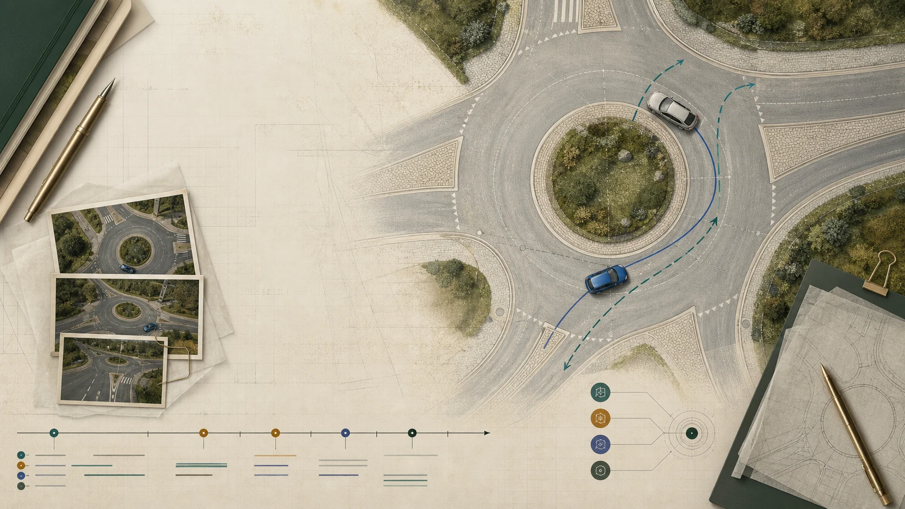
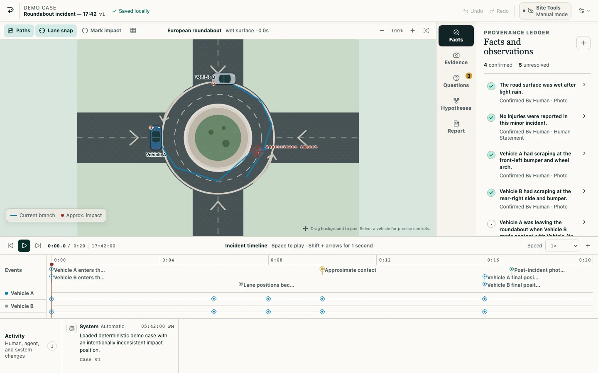

# REPLAY

**A shared black box for incidents that did not have one.** REPLAY is a local-first visual workspace where a person and an AI agent reconstruct a minor two-vehicle road incident together while keeping evidence, memory, uncertainty, dispute, and inference visibly distinct.



> REPLAY organizes and visualizes a factual account. Its calibrated geometry and motion checks are deterministic review aids, not a forensic reconstruction, collision-dynamics simulation, truth/lie detector, legal determination, or decision about fault or liability.

## Workspace preview



_Actual 1440 × 900 Playwright capture of the deterministic demo workspace. The product visual above is generated; this workspace image is a real application screenshot._

## Try it

| Destination             | Link                                                                                             |
| ----------------------- | ------------------------------------------------------------------------------------------------ |
| Live build              | [https://artem-musii.github.io/replay-sol/](https://artem-musii.github.io/replay-sol/)           |
| Live deterministic demo | [https://artem-musii.github.io/replay-sol/#demo](https://artem-musii.github.io/replay-sol/#demo) |
| Public repository       | [https://github.com/artem-musii/replay-sol](https://github.com/artem-musii/replay-sol)           |
| Demo video              | **Not recorded yet.** Add the public YouTube URL before the final Devpost submission.            |

To start without WebMCP, run the app locally and choose **Try the demo case**. Every core workspace feature remains available in an ordinary browser.

The public GitHub Pages build is a shared-origin challenge demo. Use synthetic or non-sensitive data there: browser storage is scoped to `artem-musii.github.io`, not to the `/replay-sol/` path. For sensitive evaluation, use a dedicated origin and an appropriate device/browser profile. In a local current-source build, valid saved seed-v1 through seed-v4 cases can resume; **Case options → Reset deterministic demo** replaces one with the seed-v4 fixture.

The public URL still serves the verified `00688d8a51fb783dbf147e08ece60470b8877544` release described under [Testing](#testing). The calibrated-scene, motion-envelope, integrity, and four-scenario additions described below are implemented in current source and deterministic tests; they still require a new deployment and supported-model Site Tools traces. The public video is also pending. The [WebMCP Challenge rules](https://webmcp.devpost.com/rules) require a working live URL, public source and instructions, an English submission description, and a public demonstration video under three minutes. The submission deadline is **September 3, 2026 at 1:00 PM PDT**; see the [official challenge page](https://openai.com/webmcp-challenge/).

## Learn REPLAY in the product

The onboarding is optional and replayable. Open **How to use REPLAY** from the landing page for the complete topic guide, choose **Guided demo · about 4 minutes** for a six-step workspace tour, or use **Guide** in the workspace at any time. The guide covers scene editing, timed path points, lane snap, the timeline, provenance, evidence, hypotheses, files, reports, and human-only review boundaries.

For Site Tools/WebMCP, select the **Site Tools** status in the workspace. WebMCP is the browser bridge, not an embedded chat box: keep REPLAY open in a compatible ChatGPT, Codex, or other client, then ask in that client’s conversation. A registered-tool count means the connection is ready; **Manual mode** means the full visible workflow remains available without an agent. The guide includes four copyable, narrow prompts and a link to the technical registration inspector.

Paths are timed poses rather than a collision-dynamics simulation. Set the playhead, select a vehicle or path, and add a point at that time. Two-point paths interpolate linearly; paths with three or more timed poses use a deterministic cubic Hermite curve, while heading follows the shortest angle. The renderer and swept-road checks sample the same curve. Lane snap affects nearby pointer drags only, while keyboard nudges and exact numeric fields remain precise. Select a vehicle to use its visible rotation handle, ±15° controls, or exact compass heading.

## The problem

After a minor collision, the useful record is usually fragmented across approximate memories, photographs, vehicle damage, final positions, incomplete timing, and unresolved disagreement. A form flattens those relationships into prose. A chat can quietly blur a statement into an assumption.

REPLAY gives the case a shared, inspectable structure:

- an accessible SVG road scene with vehicles, trajectories, impact, damage, and locks;
- a synchronized, editable timeline;
- claims with explicit source and certainty labels;
- local evidence with visible links into the case;
- ranked open questions and alternative hypothesis branches;
- calibrated metric geometry and deterministic consistency advisories instead of model speculation;
- attributable human, agent, and system activity; and
- a citation-bound factual report that only a person can finalize.

It is designed for drivers, claims-support teams, fleet managers, insurance intake staff, rental support teams, and neutral mediators handling minor no-injury incidents.

## Human and agent share one model

The human interface and WebMCP tools do not maintain separate incident models. Both use the same validated domain commands and authorization rules, with persistence sequencing appropriate to each caller.

```text
Human edits scene or facts              Agent calls a Site Tool
              \                              /
               same canonical command/query layer
              /                              \
   live commit + notify                 isolated engine stage
   then queued CAS save                 CAS save, then adopt + notify
              \                              /
         one visible case model + local persistence
                            |
       scene, timeline, inspector, report, activity
```

The ordinary UI can therefore show a newer in-memory case while a queued save is pending and pauses further mutations if that save fails. A WebMCP mutation does not become live until its staged case passes the version-checked save; a post-save cancellation or live conflict is compensated before the invocation settles when possible.

A useful collaboration cycle looks like this:

1. The agent reads the live scene, claims, evidence, questions, and recent activity.
2. It makes a narrow attributed change, or creates a coordinated scene proposal whose geometry remains preview-only.
3. The person directly corrects, locks, confirms, disputes, or rejects that work. Only the visible UI can adjust, accept, or reject a scene proposal.
4. The agent rereads the newer activity and revalidates rather than overwriting it.
5. Multiple unresolved explanations stay as comparable branches.
6. The agent may prepare a cited report preview, but a visible human review and manual confirmation create the immutable snapshot.

## Product tour

The seed-v4 **Roundabout incident — 17:42** case includes two vehicles with explicit dimension-source labels, calibrated metric scene bounds, four clearly labelled synthetic demo photographs, confirmed and reported observations, known damage, final positions, and open questions. Oriented vehicle footprints overlap at the reported contact instead of relying on centre-point distance, and the case never identifies a vehicle at fault.

Current source also contains a deterministic four-scenario library: the calibrated roundabout; a low-speed straight-road rear-end braking account; a T-junction crossing with unresolved priority/signal details; and an adversarial parking-area account where a reported “stationary” statement conflicts with timestamped movement. The last case demonstrates contradiction detection through the same consistency command exposed to WebMCP. It does not label a person dishonest, prove deception, or infer why the account differs. The road-template layer covers five scene types overall: roundabout, intersection, T-junction, straight road, and parking area.

Each scene records width/height in metres, a calibration source, and stated uncertainty. Vehicles record metre-scale length/width, vehicle class, dimension source, and optional wheelbase. REPLAY uses those inputs for oriented contact and road-clearance checks, samples the full swept vehicle footprint between timed poses, and emits deterministic advisories for speed, acceleration, deceleration, yaw rate, heading/travel mismatch, turn radius, and lateral acceleration. Thresholds use the recorded road context and declared inputs; they are review envelopes, not measurements of what physically happened.

In the workspace you can:

- drag and rotate vehicles, edit trajectory points, scrub or play time, and compare branch overlays;
- use keyboard controls for the scene and timeline;
- add, classify, confirm, dispute, or lock observations;
- upload JPEG, PNG, or WebP evidence locally, link it, and remove it with confirmation;
- answer ranked questions and optionally turn an answer into a reported observation;
- fork, annotate, activate, archive, restore, and compare hypotheses;
- inspect deterministic consistency findings and attributed activity;
- review reversible agent proposals before coordinated position or trajectory changes are applied;
- undo, redo, or safely revert an eligible agent action;
- build and human-review a neutral report; and
- export the case as JSON, the scene as SVG or PNG, and the report as PDF.

## WebMCP implementation

REPLAY uses the current proposed imperative API, `document.modelContext.registerTool(...)`, behind runtime feature detection. Registration begins only while a workspace is open and is divided into lifecycle groups for base, scene, facts, hypothesis, and reviewed-report capabilities. Once a baseline exists, the hypothesis group includes `build_report_preview`; `add_report_note` joins only after a preview exists. Aborting a group unregisters it. Each invocation also receives its own cancellation signal.

The current implementation defines 19 narrow imperative tools:

| Group                | Tools                                                                                                             |
| -------------------- | ----------------------------------------------------------------------------------------------------------------- |
| Read and context     | `get_case_summary`, `get_workspace_state`, `get_recent_activity`, `validate_case_consistency`                     |
| Visible coordination | `focus_workspace_item`, `revert_agent_action`, `compare_hypotheses`                                               |
| Scene                | `upsert_scene_actor`, `set_actor_trajectory`, `propose_scene_changes`, `mark_impact_event`, `mark_vehicle_damage` |
| Facts and evidence   | `add_observation`, `link_evidence`, `create_open_question`                                                        |
| Hypotheses           | `fork_hypothesis`, `update_hypothesis_assumption`                                                                 |
| Report preview       | `build_report_preview` once a baseline reconstruction exists                                                      |
| Reviewed report      | `add_report_note` after a preview exists                                                                          |

`validate_case_consistency` exposes `all`, `scene`, `timeline`, `geometry`, `motion`, `damage`, `integrity`, `provenance`, `completeness`, and `report` scopes. `scene` combines geometry, motion, and damage. This lets an agent surface calibrated footprint-separation, impact-marker, swept-road, motion-envelope, unsigned-import, source-quality, and report-readiness issues through the same rules the UI uses, without converting an advisory into a forensic, intent, or truth claim.

The visible final-review form implements the standards/Chrome declarative tool contract as `finalize_factual_report` and intentionally omits automatic submission. OpenAI's current ChatGPT/Codex Site Tools browser does not expose declarative HTML form tools as Site Tools. ChatGPT Work or Codex may still interact with a form through ordinary browser capabilities, but that interaction is not a WebMCP call and must not be treated as authorization to operate REPLAY's human confirmation controls. Agent/WebMCP-origin commands cannot confirm claims, accept/reject/adjust proposals, or finalize reports; those boundaries are enforced in the domain layer.

A human confirmation attests to one exact claim revision. Changing its statement or provenance, changing evidence/event/scene links, adding evidence to it, or deleting linked/source evidence demotes it to `reported`, clears its confirmation timestamp/flag, and appends an explicit change record. A semantic no-op does not demote it, and only a fresh human UI action can confirm it again. Unsigned structured import likewise clears imported trust attestations and finalized snapshots and is surfaced by the `integrity` checks.

Every imperative result is marked as potentially untrusted output. Read calls, visible UI-only calls, and rejected calls may appear in a capped session invocation audit without mutating the durable case; successful domain mutations append canonical activity. WebMCP mutations are staged, compare-and-swap saved, and then committed to the live engine. Repeating a completed request with the same validated semantic intent returns `idempotent: true` at the original receipt's `caseVersion` without another save; reusing the ID for different intent is rejected. A cancellation before primary persistence begins appends neither audit layer, while a cancellation after a resolved save invokes compensation.

Read the complete contracts in [WebMCP tools](docs/webmcp-tools.md), [WebMCP evals](docs/webmcp-evals.md), and the dated [source of truth](docs/source-of-truth.md).

Primary external references: the [WebMCP Draft Community Group Report](https://webmachinelearning.github.io/webmcp/), [Chrome WebMCP documentation](https://developer.chrome.com/docs/ai/webmcp), [OpenAI Site Tools documentation](https://learn.chatgpt.com/docs/webmcp), the [WebMCP Challenge](https://webmcp.devpost.com/), and its [official rules](https://webmcp.devpost.com/rules). WebMCP is a proposed, evolving standard; the repository source of truth records the retrieval dates and implementation consequences.

## Architecture

REPLAY is a static React 19 + strict TypeScript application built with Vite. The core workflow needs no server, account, analytics, location access, or runtime model API.

- `src/domain/`: schema-v2 model, Zod schemas, calibrated road templates, timed interpolation, metric geometry/motion analysis, demo scenarios, command engine, locks, optimistic versioning, idempotency, proposals, undo/redo, consistency, hypotheses, import/export, and report projections.
- `src/components/`: landing page, optional guide and workspace tour, blank-case wizard, SVG scene, timeline, inspector, activity, report review, and WebMCP inspector.
- `src/webmcp/`: schemas, tool definitions, annotations, instrumentation, registration lifecycle, feature detection, and debug state.
- `src/integration/`: adapter from WebMCP operations to canonical domain queries and commands.
- `src/persistence/`: IndexedDB case and evidence-blob storage through Dexie.
- `src/export/`: local JSON, SVG, PNG, and PDF exports.
- `tests/` and `evals/`: deterministic tests and the model-behavior evaluation specification.

See [architecture](docs/architecture.md) and [data model](docs/data-model.md) for the deeper design.

## Local setup

Requirements: Node.js 22.13 or newer and npm.

```bash
npm ci
npm run dev
```

Open [http://localhost:5173/](http://localhost:5173/) or go directly to the deterministic demo at [http://localhost:5173/#demo](http://localhost:5173/#demo).

For a production-equivalent local build:

```bash
npm run build
npm run preview
```

Vite prints the preview URL, normally `http://localhost:4173/`.

## Exact browser testing paths

### Ordinary browser fallback

1. Run `npm run dev`.
2. Open `http://localhost:5173/#demo` in a current Chromium, Firefox, or Safari build.
3. Confirm the header says manual browser mode when `document.modelContext` is absent.
4. Complete scene editing, facts, evidence, questions, hypotheses, report review, and exports through visible controls.

### WebMCP-enabled Chrome

1. Use the current Chrome WebMCP availability path documented by Chrome. For local testing, enable `chrome://flags/#enable-webmcp-testing` when that flag is present, then restart Chrome.
2. Run `npm run dev` and open `http://localhost:5173/#demo` in the same Chrome profile.
3. Open **Case options → WebMCP inspector**.
4. Confirm `document.modelContext` is detected and the expected lifecycle tools are registered.
5. Inspect annotations and schemas. If the browser exposes `getTools()` and `executeTool()`, run a read-only tool from the inspector and confirm the returned case version and visible state.
6. Execute the sequence in [docs/demo-script.md](docs/demo-script.md). Verify the successful result agrees with the persisted case and committed engine state; capture browser-paint timing separately rather than assuming paint is transactionally coupled to the tool promise.

### ChatGPT/Codex Site Tools

1. Deploy the app to HTTPS first; use the final URL ending in `/#demo`.
2. In the ChatGPT desktop app or Codex, choose a model/workspace combination currently supported by Site Tools and open that URL in the built-in browser.
3. Keep the page open and ask: “Inspect this case and separate what is confirmed, reported, unknown, and inconsistent.”
4. Confirm the agent discovers REPLAY’s page tools, calls the read-only operations, and focuses the live inconsistency.
5. Continue with the prompts in [docs/demo-script.md](docs/demo-script.md).

WebMCP and Site Tools remain evolving and rollout-dependent. A fallback status does not disable the manual product. Current external API and availability notes are recorded with dates and official links in [docs/source-of-truth.md](docs/source-of-truth.md).

## Testing

```bash
npm run format:check
npm run lint
npm run typecheck
npm run test
npm run test:e2e
npm run build
```

The repository contains deterministic coverage for the domain engine, schema migration/import/report rules, exact-revision claim attestations, unsigned import, proposals, persistence conflict and recovery behavior, semantic-intent idempotency, staged WebMCP save/commit/compensation behavior, calibrated geometry, motion envelopes, smooth timed interpolation, four demo scenarios, onboarding, timed path authoring and rotation, narrow/200%-text reflow, timeline/dialog behavior, export regressions, the real adapter, and the WebMCP registry. The model-behavior cases in `evals/webmcp-evals.json` are an evaluation specification; they are not presented as captured model-run results.

**Current deployed release:** application commit [`00688d8a51fb783dbf147e08ece60470b8877544`](https://github.com/artem-musii/replay-sol/commit/00688d8a51fb783dbf147e08ece60470b8877544) passed [GitHub Actions run `33161848637`](https://github.com/artem-musii/replay-sol/actions/runs/33161848637), including verify job `98817932649` and deploy job `98818739202`: **136/136 Vitest tests across 15 files** and **108 Playwright project runs: 103 passed, 5 intentional mobile screenshot-owner skips, and 0 failed**, with 10 checked screenshot baselines. Pages deployment `6139340101` published artifact `9682041096` (3,009,246 bytes; SHA-256 `9fae713230ec290ca8255641b1d13c89d59b155041aa9a68403d3231caff645e`); all 43 public files byte-matched that artifact. A cache-busted public Lighthouse 13.4.1 audit scored **100/100/100/100** for performance, accessibility, best practices, and SEO, with FCP 503.479 ms, LCP/TTI 623.479 ms, Speed Index 745.184 ms, TBT 0 ms, and CLS 0 (report SHA-256 `7c903b69675faa5e70283876434cca6da501a56d8c44d058706c5c90262714e4`).

A fresh live smoke of that deployed commit opened the optional guide, checked the WebMCP experience, loaded its deterministic seed-v3 case, and exercised vehicle rotation, trajectory-point addition, uncertainty editing, and retained-recovery onboarding access. It completed with zero console warnings/errors, failed requests, or off-origin requests. A separate Codex in-app-browser smoke surfaced all 18 baseline Site Tools and the visible `18 registered` state without invoking a tool. Those historical deployed checks do not cover the current-source seed-v4 realism/integrity additions and do not establish supported-model execution traces or broad native-client compatibility. The older `f980d28` results remain preserved as historical evidence. A current-source deployment, supported-model/native Site Tools execution, screen-reader/cross-browser/export review, a dedicated header-capable origin, and the public video remain external gates.

See [docs/testing.md](docs/testing.md) for fixtures, exact results, manual checks, Site Tools steps, and how to record results without conflating deterministic tests with probabilistic evals.

## Privacy, safety, and limitations

- Cases and uploaded evidence stay in this browser’s IndexedDB in manual mode unless the person explicitly exports a file. In Site Tools mode, structured text and metadata returned by a called tool can be processed by the connected agent/client and its model service; evidence image bytes are not returned by REPLAY tools.
- The core app has no REPLAY-operated backend, analytics call, geolocation lookup, evidence-upload service, or runtime model API. This does not make an external Site Tools client part of the local-only boundary.
- User statements, filenames, notes, and evidence metadata are treated as untrusted case data, not executable instructions.
- “Confirmed” means explicitly confirmed by a person in REPLAY; it does not mean independently verified.
- Consistency checks use declared calibration, vehicle dimensions, timed poses, road context, and explicit deterministic thresholds to organize contradictions and missing information. They are not a forensic reconstruction, collision-dynamics simulation, truth/lie assessment, legal advice, or a fault decision.
- JSON is a structured case transfer, not a full-fidelity backup: it excludes evidence bytes, and unsigned import deliberately clears or demotes local trust attestations and report snapshots.
- Local browser storage is not application-level encrypted. GitHub Pages also shares the `artem-musii.github.io` storage origin with other projects. Do not use the prototype for highly sensitive production records without a dedicated origin, appropriate security review, and retention policy.

Read [security and privacy notes](docs/security-and-privacy-notes.md) for the threat model and residual risks.

## Generated assets

The landing hero and four demo evidence images are original synthetic assets generated during development with the built-in image-generation mode. They are used only for the product visual and clearly labeled demo evidence; functional scene geometry remains semantic SVG. No user evidence is sent to an image model at runtime.

Prompts, dimensions, file sizes, visual-review criteria, and SHA-256 checksums are disclosed in [docs/generated-assets.md](docs/generated-assets.md).

## Deployment

`npm run build` creates the static application in `dist/`. GitHub Actions publishes `main` to [GitHub Pages](https://artem-musii.github.io/replay-sol/) over HTTPS. The build injects a restrictive CSP and no-referrer policy in HTML; provider-neutral `_headers` are also included for hosts such as Cloudflare Pages or Netlify that support full response policies.

GitHub Pages does not apply the repository’s `_headers` file, so response-only defenses such as `Permissions-Policy`, COOP/COEP, and `X-Frame-Options` remain deployment limitations. The current application also refuses to render the workspace or register tools when framed; that runtime guard complements but does not replace response headers. See [docs/deployment.md](docs/deployment.md) for the exact deployed artifact record, live checks, evidence boundaries, and stricter-host alternative.

## Project documents

- [Demo script](docs/demo-script.md) and [storyboard](docs/demo-storyboard.md)
- [Devpost submission draft](docs/devpost-submission.md)
- [Judging matrix](docs/judging-matrix.md)
- [Testing guide](docs/testing.md)
- [Dependency and license notes](docs/dependency-notes.md)
- [Implementation status](IMPLEMENTATION_STATUS.md)

## License

Source code in this repository is available under the [MIT License](LICENSE). Generated asset use remains subject to the applicable generation service terms; do not present the synthetic demo images as real incident evidence.
