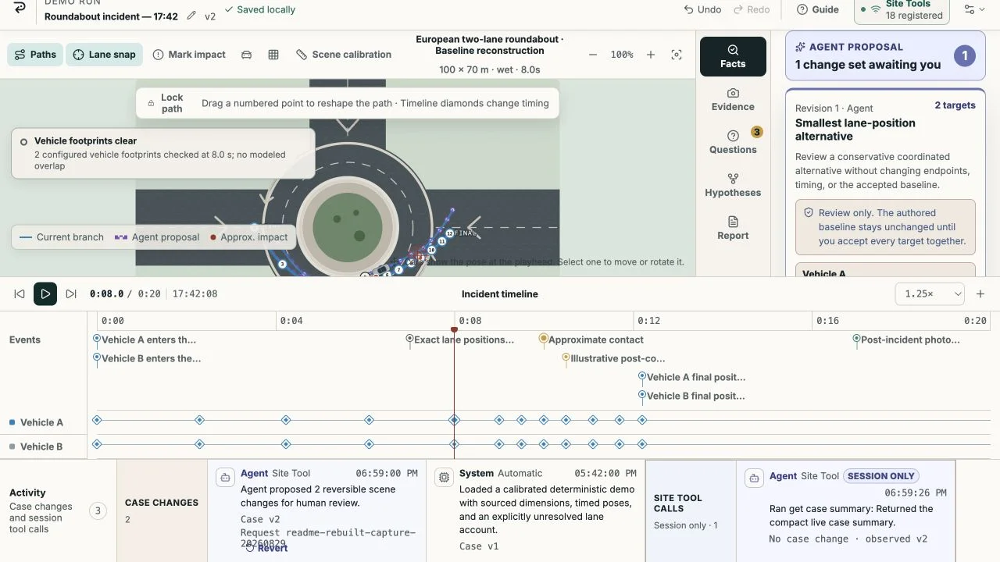

# REPLAY

**A shared black box for incidents that did not have one.** After a minor no-injury collision, a driver and claims-intake reviewer need to turn photographs, damage, final positions, timing, and conflicting memories into a record they can inspect. REPLAY gives them one local-first visual case where evidence, memory, uncertainty, dispute, and inference remain visibly distinct—and a cited report that no Site Tool can finalize.

[Live app](https://artem-musii.github.io/replay/) · [Deterministic judge case](https://artem-musii.github.io/replay/#demo) · [MIT License](LICENSE) · [Third-party notices](THIRD_PARTY_NOTICES.md)



_Historical 1280 × 720 capture from a pre-`b2e93905` configured-base payload in the Codex in-app browser. It shows the Scene calibration UI, 1.25× playback, 12-point paths, 18 registered Site Tools, the live baseline beside a pending review-only proposal, and separate case/session activity. The proposal call was operator-directed; this is neither current-payload nor supported-model-choice evidence._

> REPLAY organizes and visualizes a factual account. Its calibrated geometry and motion checks are deterministic review aids, not a forensic reconstruction, collision-dynamics simulation, truth/lie detector, legal determination, or decision about fault or liability.

## Try it

| Destination             | Link                                                                                     |
| ----------------------- | ---------------------------------------------------------------------------------------- |
| Live build              | [https://artem-musii.github.io/replay/](https://artem-musii.github.io/replay/)           |
| Live deterministic demo | [https://artem-musii.github.io/replay/#demo](https://artem-musii.github.io/replay/#demo) |
| Public repository       | [https://github.com/artem-musii/replay](https://github.com/artem-musii/replay)           |
| Open-source license     | [MIT](LICENSE)                                                                           |
| Demo video              | **Not recorded yet.** Add the public YouTube URL before the final Devpost submission.    |

**Fast judge prompt:** Open the deterministic demo in ChatGPT's built-in browser and ask: “Use this page's Site Tools to review the unresolved lane-position question. Read the live scene, evidence relationships, and full consistency results; focus the blocker; then create the smallest coordinated two-car alternative for review from the existing timed paths. Keep the baseline, claims, endpoints, point IDs, times, and unrelated geometry unchanged. Explain the missing evidence, your assumptions, the before/after versions, and what remains unresolved. Do not apply anything, confirm or answer claims, or infer fault.” The in-product Site Tools guide also provides an exact-coordinate deterministic fallback for repeatable evaluation.

To start without WebMCP, run the app locally and choose **Open Roundabout demo**. Every core workspace feature remains available in an ordinary browser.

The public GitHub Pages build is a shared-origin challenge demo. Use synthetic or non-sensitive data there: browser storage is scoped to `artem-musii.github.io`, not to the `/replay/` path. For sensitive evaluation, use a dedicated origin and an appropriate device/browser profile. In current source, `/#demo`, a landing-page scenario card, and **Case options → Start fresh demo copy** each create a new seed-v6 run without overwriting an earlier one, then replace the location with a stable `#case/<encoded-case-id>` route. The landing page lists every retained run under **Your local cases**, where a visible, cancel-first human control can permanently remove one local case and its stored evidence bytes. Site Tools cannot request that deletion. A saved run resumes only from its route in the same origin and browser profile; an unavailable route shows a recovery message instead of opening a different case. Valid legacy seed-v1 through seed-v6 records remain loadable.

The public URL serves the verified seed-v6 application release at [`b252fbde9551d0a1d2c41a1282ced66dc8ae1b20`](https://github.com/artem-musii/replay/commit/b252fbde9551d0a1d2c41a1282ced66dc8ae1b20), including the full trust, persistence, accessibility, report, release-verification, calibrated-scene, impact-response, and four-scenario work described here. Its WebMCP proposal contract now makes complete single- or multi-actor start-to-final reconstruction explicit while preserving human-only application, and playback invalidates stale animation sessions so one click reliably continues from the impact pause. CI, deployment, and byte-for-byte public verification are complete. An uncoached supported-model Site Tools trace with native **Recently used/Sources** and the public video are still pending. The [WebMCP Challenge rules](https://webmcp.devpost.com/rules) require a working live URL, public source/instructions/license, an English submission description, free judge access, and a public YouTube demonstration under three minutes with audio showing actual WebMCP use. The submission deadline is **September 3, 2026 at 1:00 PM PDT**; see the [official challenge page](https://openai.com/webmcp-challenge/).

## The three-minute judge path

A screenshot can show two vehicles, but it cannot reliably tell an agent which timed point belongs to which branch, whether a statement is photo-backed or disputed, whether a path is locked, or which case version is current. WebMCP exposes those exact live semantics and validated actions. Its writes pass through the same domain commands as visible UI actions, so every proposal is attributable and inspectable in the one case the person sees—never an agent-only shadow copy.

**Agent: read, validate, propose, draft. Reviewer: attest, decide, finalize.**

In one coherent demo, a judge can see the complete contract:

1. **Inspect the record without overstating it.** The authored roundabout paths visibly slow and diverge after the reported contact, while the inspector labels the comparison as authored motion—not simulated collision physics or proof of causation.
2. **Use native Site Tools on live structured state.** The agent reads the scene and facts, runs REPLAY's deterministic consistency checks, and focuses the result in the same workspace.
3. **Keep proposal, inference, and fact separate.** A coordinated geometry proposal remains a reversible preview; an agent hypothesis stays attributed and unconfirmed; no Site Tool can adjust, accept, or reject that proposal or confirm an eligible statement. Those commands require the visible UI review origin.
4. **Turn the record into a practical output.** The agent prepares a neutral, citation-bound report preview, but only a visible human review can create the immutable final snapshot.

The exact recording sequence, pass cues, and native-tool proof requirements are in the [under-three-minute demo script](docs/demo-script.md).

## Challenge-period provenance

REPLAY was created during the Challenge submission window, not extended from a pre-existing product. The repository's first commit, `c95df75`, is dated **August 27, 2026**, after submissions opened on August 25. The public history then records the WebMCP command bridge, shared human-agent domain model, releases, onboarding, calibrated realism, and review safeguards. Preserve that dated history with the final submission so judges can distinguish eligible Challenge work directly.

## Learn REPLAY in the product

The onboarding is optional and replayable. Open **How to use REPLAY** from the landing page for the complete topic guide, choose **Take the 6-step guided tour** for a mutation-free workspace walkthrough, or use **Guide** in the workspace at any time. The guide covers scene editing, timed path points, lane snap, the timeline, provenance, evidence, hypotheses, files, reports, and human-only review boundaries.

For Site Tools/WebMCP, select the **Site Tools** status in the workspace. WebMCP is the browser bridge, not an embedded chat box: keep REPLAY open in a compatible ChatGPT, Codex, or other client, then ask in that client’s conversation. A registered-tool count means the page registered its inventory; confirm client discovery in **Available site tools** and real calls in **Recently used/Sources**. **Manual mode** means the full visible workflow remains available without an agent. When tools are available, the guide leads with one copyable 30-second proof—structured read, validation, and a pending review-gated proposal—followed by four narrower prompts and the technical registration inspector.

Paths are timed poses rather than a collision-dynamics simulation. Set the playhead, select a vehicle or path, and add a point at that time. Two-point paths interpolate linearly; paths with three or more timed poses use a deterministic cubic Hermite curve, while heading follows the shortest angle. The renderer and swept-road checks sample the same curve. Selecting an impact compares the authored incoming and outgoing segment speeds and courses; it never generates a response or treats the marker as the cause. If the event falls between authored points, the motion review asks whether an explicit impact-time point is needed. Lane snap affects nearby pointer drags only, while keyboard nudges and exact numeric fields remain precise. Select a vehicle to use its visible rotation handle, ±15° controls, or exact compass heading.

## The problem

After a minor collision, the useful record is usually fragmented across approximate memories, photographs, vehicle damage, final positions, incomplete timing, and unresolved disagreement. A form flattens those relationships into prose. A chat can quietly blur a statement into an assumption.

REPLAY gives the case a shared, inspectable structure:

- an accessible SVG road scene with vehicles, trajectories, impact, damage, and locks;
- a synchronized, editable timeline;
- claims with explicit source and certainty labels;
- local evidence with visible links into the case;
- ranked open questions and alternative hypothesis branches;
- explicit human completeness records for a legitimate no-evidence case, unassessed/unknown damage, and completed uncertainty review;
- calibrated metric geometry and deterministic consistency advisories instead of model speculation;
- attributable human, agent, and system activity; and
- a citation-bound factual report that no Site Tool can finalize; finalization requires the visible review flow.

It is designed first for a driver documenting a minor no-injury incident and the claims-intake reviewer turning that account into a reviewable record. Claims-support, fleet, rental-support, and neutral-mediation teams are adjacent users of the same workflow.

## Human and agent share one model

The human interface and WebMCP tools do not maintain separate incident models. Both use the same validated domain commands and authorization rules, with persistence sequencing appropriate to each caller.

```text
Human edits scene or facts              Agent calls a Site Tool
              \                              /
               same canonical command/query layer
              /                              \
   live commit + notify                 isolated engine stage
   then queued CAS save                 CAS save, then adopt + notify
              \                              /
         one visible case model + local persistence
                            |
       scene, timeline, inspector, report, activity
```

The ordinary UI can therefore show a newer in-memory case while a queued save is pending and pauses further mutations if that save fails. Only a successful durable retry resumes editing; the optional structured-transfer download is explicitly incomplete and does not act as a save. A WebMCP mutation does not become live until its staged case passes the version-checked save; a post-save cancellation or live conflict is compensated before the invocation settles when possible.

A useful collaboration cycle looks like this:

1. The agent reads the live scene, claims, evidence, questions, and recent activity.
2. It makes a narrow attributed change, or creates a coordinated scene proposal whose geometry remains preview-only.
3. The person directly corrects, locks, confirms, disputes, rejects, or records a reviewed completeness outcome. Only the visible UI can adjust, accept, or reject a scene proposal or create a completeness attestation.
4. The agent rereads the newer activity and revalidates rather than overwriting it.
5. Multiple unresolved explanations stay as comparable branches.
6. The agent may prepare a cited report preview, but a visible human review and manual confirmation create the immutable snapshot.

## Product tour

The seed-v6 **Roundabout incident — 17:42** case includes two vehicles with explicit dimension-source labels, calibrated metric scene bounds, four clearly labelled synthetic demo photographs, confirmed and reported observations, known damage, final positions, and open questions. Oriented vehicle footprints meet at the reported contact instead of relying on centre-point distance. The authored post-contact legs visibly slow and diverge, while the inspector keeps that geometry distinct from simulated collision dynamics or causation. The case never identifies a vehicle at fault.

Current source also contains a deterministic four-scenario library. The high-speed straight-road case derives a 65–80 km/h approach from authored path timing, labels it as unmeasured, and asks what telemetry or roadway evidence could support it. The parking-area case contrasts a reported “stationary” account with positions 3.5 metres apart one second apart—an authored 12.6 km/h leg. The same consistency command therefore distinguishes a missing-measurement question from a low-speed record conflict without treating either as truth, intent, or fault. The calibrated roundabout and road-speed T-junction complete the set, while the road-template layer covers roundabout, intersection, T-junction, straight road, and parking area.

Each scene records width/height in metres, a calibration source, and stated uncertainty. Vehicles record metre-scale length/width, vehicle class, dimension source, and optional wheelbase. REPLAY uses those inputs for oriented contact and road-clearance checks, samples the full swept vehicle footprint between timed poses, and emits deterministic advisories for speed, acceleration, deceleration, yaw rate, heading/travel mismatch, turn radius, and lateral acceleration. Thresholds use the recorded road context and declared inputs; they are review envelopes, not measurements of what physically happened.

In the workspace you can:

- drag and rotate vehicles, edit trajectory points, scrub or play time, and compare branch overlays;
- place or correct an impact for the exact selected vehicle pair in a three- or four-vehicle case without overwriting other pair contacts;
- use keyboard controls for the scene and timeline;
- add, classify, confirm, dispute, or lock observations;
- upload JPEG, PNG, or WebP evidence locally, link it, and remove it with confirmation;
- answer ranked questions and optionally turn an answer into a reported observation;
- fork, annotate, activate, archive, restore, and compare hypotheses;
- inspect deterministic consistency findings and attributed activity;
- complete human-only readiness review when no evidence was supplied, an actor's damage is unknown/not assessed, or the uncertainty register has been reviewed;
- review reversible agent proposals before coordinated position or trajectory changes are applied;
- undo, redo, or safely revert an eligible agent action;
- build and human-review a neutral report; and
- export the case as JSON, the scene as SVG or PNG, and the report as PDF.

## WebMCP implementation

REPLAY feature-detects `document.modelContext`, then registers through its imperative `modelContext.registerTool(...)` method. Registration begins only while a workspace is open and is divided into lifecycle groups for base, scene, facts, hypothesis, and reviewed-report capabilities. Once a baseline exists, the hypothesis group includes `build_report_preview`; `add_report_note` joins only while the current transient preview exists. A successful note invalidates and closes that preview, so the tool leaves the next inventory until a fresh preview is built at the new case version. Aborting a group unregisters it. Each invocation also receives its own cancellation signal.

The current implementation defines 19 narrow imperative tools:

| Group                | Tools                                                                                                             |
| -------------------- | ----------------------------------------------------------------------------------------------------------------- |
| Read and context     | `get_case_summary`, `get_workspace_state`, `get_recent_activity`, `validate_case_consistency`                     |
| Visible coordination | `focus_workspace_item`, `revert_agent_action`, `compare_hypotheses`                                               |
| Scene                | `upsert_scene_actor`, `set_actor_trajectory`, `propose_scene_changes`, `mark_impact_event`, `mark_vehicle_damage` |
| Facts and evidence   | `add_observation`, `link_evidence`, `create_open_question`                                                        |
| Hypotheses           | `fork_hypothesis`, `update_hypothesis_assumption`                                                                 |
| Report preview       | `build_report_preview` once a baseline reconstruction exists                                                      |
| Reviewed report      | `add_report_note` while the current transient preview exists; one successful note invalidates that preview        |

`upsert_scene_actor` requires the full label/pose/dimension set when creating an actor. For an existing `actorId`, it accepts only the fields that should change and preserves omitted trusted specifications; an unknown ID fails instead of silently creating a different record. Existing-actor position/rotation edits, and any `actor-pose` proposal, must include `expectedPoseTarget.branchId` and `expectedPoseTarget.playheadTimeMs` copied from the latest scene read; a moved visible target fails with `VERSION_CONFLICT` instead of editing a different pose.

`validate_case_consistency` exposes `all`, `scene`, `timeline`, `geometry`, `motion`, `damage`, `integrity`, `provenance`, `completeness`, and `report` scopes. `scene` combines geometry, motion, and damage. This lets an agent surface calibrated footprint-separation, impact-marker, swept-road, motion-envelope, unsigned-import, source-quality, and report-readiness issues through the same rules the UI uses, without converting an advisory into a forensic, intent, or truth claim.

The visible final-review form implements the standards/Chrome declarative tool contract as `finalize_factual_report` and intentionally omits automatic submission. OpenAI's current ChatGPT/Codex Site Tools browser does not expose declarative HTML form tools as Site Tools. ChatGPT Work or Codex may still interact with a form through ordinary browser capabilities, but that interaction is not a WebMCP call and must not be treated as authorization to operate REPLAY's human confirmation controls. Agent/WebMCP-origin commands cannot confirm claims, create or withdraw completeness attestations, accept/reject/adjust proposals, or finalize reports; those boundaries are enforced in the domain layer. Agents can report readiness gaps through consistency checks, but no Site Tool can attest that a human review occurred.

A human confirmation attests to one exact claim revision. Changing its statement or provenance, changing evidence/event/scene links, adding evidence to it, or deleting linked/source evidence demotes it to `reported`, clears its confirmation timestamp/flag, and appends an explicit change record. A semantic no-op does not demote it, and only a fresh human UI action can confirm it again. Unsigned structured import likewise clears imported trust attestations and finalized snapshots and is surfaced by the `integrity` checks.

The **Completeness review** provides equally explicit human/UI-only records for **no evidence supplied**, each actor's damage as **unknown** or **not assessed**, and **uncertainty review complete**. Each record is fingerprinted to the exact relevant evidence, damage, or question state; a later relevant change makes it stale without erasing its history. Reports label current records **Human attestation** and cite their canonical paths, while warning that they are review records—not evidence of absence or proof that an unknown is certain. Unsigned imports retain them only as untrusted history until a fresh local UI review.

Canonical references are exact rather than advisory indexes: each trajectory/event/branch claim has one owning branch entry, each actor has at most one trajectory per branch, and marker/evidence, marker/claim, claim/evidence, event/claim, and event/evidence relationships are reciprocal and duplicate-free. New saves and structured imports reject ambiguity. The local IndexedDB read path alone repairs the narrow asymmetric-link and global-claim shapes produced by released builds, bumps the case version, and records a system migration activity; ambiguous duplicate trajectories remain quarantined for recovery instead of being guessed into shape.

Every imperative result is marked as potentially untrusted output. Read calls, visible UI-only calls, and rejected calls may appear in a capped session invocation audit without mutating the durable case; successful domain mutations append canonical activity. WebMCP mutations are staged, compare-and-swap saved, and then committed to the live engine. Repeating a completed request with the same validated semantic intent returns `idempotent: true` at the original receipt's `caseVersion` without another save; reusing the ID for different intent is rejected. A cancellation before primary persistence begins appends neither audit layer, while a cancellation after a resolved save invokes compensation.

Read the complete contracts in [WebMCP tools](docs/webmcp-tools.md), [WebMCP evals](docs/webmcp-evals.md), and the dated [source of truth](docs/source-of-truth.md).

Primary external references: the [WebMCP Draft Community Group Report](https://webmachinelearning.github.io/webmcp/), [Chrome WebMCP documentation](https://developer.chrome.com/docs/ai/webmcp), [OpenAI Site Tools documentation](https://learn.chatgpt.com/docs/webmcp), the [WebMCP Challenge](https://webmcp.devpost.com/), and its [official rules](https://webmcp.devpost.com/rules). WebMCP is a proposed, evolving standard; the repository source of truth records the retrieval dates and implementation consequences.

## Architecture

REPLAY is a static React 19 + strict TypeScript application built with Vite. The core workflow needs no server, account, analytics, location access, or runtime model API.

- `src/domain/`: schema-v2 model, Zod schemas, calibrated road templates, timed interpolation, metric geometry/motion analysis, demo scenarios, command engine, locks, optimistic versioning, idempotency, proposals, undo/redo, consistency, hypotheses, import/export, and report projections.
- `src/components/`: landing page, optional guide and workspace tour, blank-case wizard, SVG scene, timeline, inspector, activity, report review, and WebMCP inspector.
- `src/webmcp/`: schemas, tool definitions, annotations, instrumentation, registration lifecycle, feature detection, and debug state.
- `src/integration/`: adapter from WebMCP operations to canonical domain queries and commands.
- `src/persistence/`: IndexedDB case and evidence-blob storage through Dexie.
- `src/export/`: local JSON, SVG, PNG, and PDF exports.
- `tests/` and `evals/`: deterministic tests and the model-behavior evaluation specification.

See [architecture](docs/architecture.md) and [data model](docs/data-model.md) for the deeper design.

## Local setup

Requirements: Node.js 22.13 or newer and npm.

```bash
npm ci
npm run dev
```

Open [http://localhost:5173/](http://localhost:5173/) or go directly to the deterministic demo at [http://localhost:5173/#demo](http://localhost:5173/#demo).

For a production-equivalent local build:

```bash
npm run build
npm run preview
```

Vite prints the preview URL, normally `http://localhost:4173/`.

## Exact browser testing paths

### Ordinary browser fallback

1. Run `npm run dev`.
2. Open `http://localhost:5173/#demo` in a current Chromium, Firefox, or Safari build.
3. Confirm the header says manual browser mode when `document.modelContext` is absent.
4. Complete scene editing, facts, evidence, questions, hypotheses, report review, and exports through visible controls.

### WebMCP-enabled Chrome

1. Use Chrome 149 or later, following the current Chrome WebMCP origin-trial guidance. For local testing, enable `chrome://flags/#enable-webmcp-testing`, then restart Chrome.
2. Run `npm run dev` and open `http://localhost:5173/#demo` in the same Chrome profile.
3. Open **Case options → WebMCP inspector**.
4. Confirm `document.modelContext` is detected and the expected lifecycle tools are registered.
5. Inspect annotations and schemas. If the browser exposes `getTools()` and `executeTool()`, run a read-only tool from the inspector and confirm the returned case version and visible state.
6. Execute the sequence in [docs/demo-script.md](docs/demo-script.md). Verify the successful result agrees with the persisted case and committed engine state; capture browser-paint timing separately rather than assuming paint is transactionally coupled to the tool promise.

### ChatGPT/Codex Site Tools

1. Deploy the app to HTTPS first; use the final URL ending in `/#demo`.
2. In the ChatGPT desktop app or Codex, choose a model/workspace combination currently supported by Site Tools and open that URL in the built-in browser.
3. Keep the page open and ask: “Inspect this case and separate what is confirmed, reported, unknown, and inconsistent.”
4. Confirm the agent discovers REPLAY’s page tools, calls the read-only operations, and focuses the live inconsistency.
5. Continue with the prompts in [docs/demo-script.md](docs/demo-script.md).

WebMCP and Site Tools remain evolving and rollout-dependent. A fallback status does not disable the manual product. Current external API and availability notes are recorded with dates and official links in [docs/source-of-truth.md](docs/source-of-truth.md).

## Testing

```bash
npm run format:check
npm run lint
npm run typecheck
npm run test
npx playwright install chromium firefox webkit
npm run test:e2e
npm run build
```

The repository contains deterministic coverage for the domain engine, schema migration/import/report rules, the cancel-first import trust-reset review, exact-revision claim and completeness attestations, source-enforced photo/document observations, human-only evidence unlinking without asset deletion, legitimate no-evidence finalization, unsigned-import trust reset, proposals, persistence conflict and recovery behavior, semantic-intent idempotency, staged WebMCP save/commit/compensation behavior, calibrated geometry, motion envelopes, smooth timed interpolation, four demo scenarios, stable local-case routing/listing, exact multi-vehicle impact-pair placement, onboarding, timed path authoring and rotation, narrow/200%-text reflow, timeline/dialog behavior, export regressions, the real adapter, and the WebMCP registry. The model-behavior cases in `evals/webmcp-evals.json` are an evaluation specification; they are not presented as captured model-run results.

**Current deployed application payload:** application commit [`b252fbde9551d0a1d2c41a1282ced66dc8ae1b20`](https://github.com/artem-musii/replay/commit/b252fbde9551d0a1d2c41a1282ced66dc8ae1b20) passed [GitHub Actions run `33274844653`](https://github.com/artem-musii/replay/actions/runs/33274844653), including verify/build job `99159652619`, deploy job `99160674554`, and post-deploy byte-verification job `99160705929`: **460/460 Vitest tests across 37 files**, **230 Playwright project runs: 221 passed, 9 intentional mobile screenshot-owner skips, and 0 failed**, plus a **12/12** configured-base release matrix. Pages deployment `6160091470` published artifact `9721285202` (3,655,679 compressed bytes; SHA-256 `5505a03a515a0c455f786a0f9fec7a6d9376d7046c77072d9df6d9c2412d8e1b`). The retained release-evidence artifact is `9721284748` (SHA-256 `280d1f1c3e345b0a10655ec2afdbf3ed29b39c6f56155ea7e775f72a49c0c875`). The live [`release-evidence.json`](https://artem-musii.github.io/replay/release-evidence.json) identifies the latest clean wrapper commit and attests the same **46 public payload files / 5,297,092 bytes** with manifest SHA-256 `22c26f2b61944986272a28d7568fd1421b96b62d37e07dec60fd34895f2aa9c9`; hosted CI and independent post-deploy verification fetch and match every file. Documentation/test-only follow-up commits may therefore change the wrapper commit recorded by that endpoint without changing the attested application payload.

**Superseded public-browser evidence:** the preceding seed-v6 `cd88755b` operator bridge, product, and Lighthouse checks remain historical to those exact bytes. Commit `00688d8a51fb783dbf147e08ece60470b8877544` retains its cache-busted 100/100/100/100 Lighthouse report and the live seed-v3 guide, scene/path-editing, recovery, and 18-tool discovery smokes. Those checks are not attributed to the current release or presented as supported-model execution. The older `f980d28` and seed-v5 `2855f0bc` results are likewise preserved as historical evidence. An exact-current-deployment supported-model trace, a final real-device/screen-reader spot check, a dedicated header-capable origin for full response-policy claims, and the public video remain external gates.

**Current-release verification:** the 2026-08-29 hosted release gate passed **460/460 Vitest tests across 37 files** on Node 22.13.0 and all **230 Playwright project runs: 221 passed, 9 intentional mobile screenshot-owner skips, and 0 failed**, with 20 checked visual baselines. The browser split was 114/114 desktop Chromium, 105 passed plus 9 intentional skips in mobile Chrome, and 1/1 release smoke in both Firefox and WebKit. Hosted V8 coverage was **63.78% statements (6,781/10,631), 54.28% branches (4,500/8,289), 62.04% functions (1,628/2,624), and 65.85% lines (6,276/9,530)**. In a separate post-fix local stress run, the final playback guard passed **50/50** repeated exact-impact resume checks across desktop/mobile and **20/20** mixed critical journeys with no flake. Format, zero-warning ESLint, strict TypeScript, both dependency audits with 0 vulnerabilities, dependency-tree resolution, default and `/replay/` production builds, and `git diff --check` passed.

The Node 22.13.0 root artifact contains **46 public payload files / 5,296,840 bytes**, plus the deployment-control `.nojekyll`, with manifest SHA-256 `efcc58d83a224460c2d53ebd1c14786095f91cd07a2f17c8b22c13afcbbeced0`. The `/replay/` artifact contains **46 public payload files / 5,297,092 bytes**, plus `.nojekyll`, with manifest SHA-256 `22c26f2b61944986272a28d7568fd1421b96b62d37e07dec60fd34895f2aa9c9`. The configured-base artifact passed **12/12** focused runs against that exact already-built subpath artifact: the release/high-speed/impact matrix **8/8**, handler contract **2/2**, and submission story **2/2** on desktop and mobile. The handler run used the deterministic imperative `document.modelContext` polyfill, registered 18 lifecycle-eligible tools without churn, and returned all eight requested workspace sections—including explicit `selection: null`—in a complete **18,970-byte** response at case v1, below the **32,768-byte compact target** and 524,288-byte hard cap. Deterministic registry/adapter coverage separately proves that a one-actor full trajectory proposal keeps canonical geometry unchanged until a visible human acceptance, while the submission story exercises the 18→19→18 lifecycle, proposal/rejection, impact response, provenance-safe inference, human confirmation/finalization, and PDF export.

An operator opened the preceding `cd88755b` configured-base payload in the Codex in-app browser and invoked four page-defined Site Tools through its native bridge: `get_case_summary`, `get_workspace_state` for scene/questions, all-scope `validate_case_consistency`, and `focus_workspace_item` for `question-lane-change`. All returned `ok: true` at case v1; validation returned the single `integrity.calibration-source` question, focus visibly opened that question, and the activity panel showed one durable seed change plus four session-only calls, each labelled **No case change · observed v1**. Browser runtime logs contained no warning or error. This remains historical page-bridge and visible UI/session-audit evidence for that payload—not current-deployment or supported-model choice, **Recently used/Sources**, mutation/lifecycle, or broad cross-client evidence.

A post-deploy in-app-browser smoke of the preceding `cd88755b` payload independently exercised its read/UI bridge and remains historical to those bytes. A separate cache-busted operator smoke of the pre-rename `b2e93905` deployment selected the exact 10.000 s impact marker and advanced to 17.7 s after one Play click; from 9.5 s it auto-paused once at 10.0 s, then advanced to 15.9 s and remained playing after one resume. The public technical inspector visibly exposed `propose_scene_changes` with `changes.minItems=1`, full `trajectory-set` start/final semantics, and separate `mark_impact_event` semantics. There were no console errors or failed dynamic requests. The renamed release passed the same deterministic behavior and contract checks in hosted CI; neither result is native Site Tools invocation or supported-model choice.

A fresh cache-busted ordinary-browser smoke of the renamed `b252fbde` deployment selected the 9.5 s keyframe, auto-paused once at the 10.0 s impact, and reached the 20.0 s end after exactly one Play click. The browser recorded zero console errors and no failed dynamic requests. This is current live playback evidence, not native Site Tools or supported-model evidence.

Lighthouse 13.4.1 with Chrome 151 completed three warning-free runs per profile against the preceding `cd88755b` configured-base artifact. The mobile runs scored **89/91/90 performance**, all with **100 accessibility / 100 best practices / 100 SEO**, for median performance **90** and medians of FCP **2.032 s**, LCP **3.308 s**, TBT **17 ms**, CLS **0.00004**, Speed Index **2.032 s**, and TTI **3.308 s**; every desktop run scored **100/100/100/100**, with medians of FCP **0.445 s**, LCP **0.686 s**, TBT **0 ms**, CLS **0.0149**, Speed Index **0.529 s**, and TTI **0.686 s**. That lab result remains historical rather than a current-payload performance claim. Rendered-export and responsive-layout review from the same release also remains useful historical evidence; the current release retains automated layout/export regressions.

The clean-tree artifact verifier, hosted CI, Pages deployment, and independent public-byte verification all passed for the release above. An uncoached supported-model trace on the final deployment with **Recently used/Sources** and the public video remain pending. The operator-directed traces above are not presented as model-choice evidence.

See [docs/testing.md](docs/testing.md) for fixtures, exact results, manual checks, Site Tools steps, and how to record results without conflating deterministic tests with probabilistic evals.

## Privacy, safety, and limitations

- Cases and uploaded evidence stay in this browser’s IndexedDB in manual mode unless the person explicitly exports a file. In Site Tools mode, structured text and metadata returned by a called tool can be processed by the connected agent/client and its model service; evidence image bytes are not returned by REPLAY tools.
- The core app has no REPLAY-operated backend, analytics call, geolocation lookup, evidence-upload service, or runtime model API. This does not make an external Site Tools client part of the local-only boundary.
- User statements, filenames, notes, and evidence metadata are treated as untrusted case data, not executable instructions.
- “Confirmed” means explicitly confirmed by a person in REPLAY; it does not mean independently verified.
- Consistency checks use declared calibration, vehicle dimensions, timed poses, road context, and explicit deterministic thresholds to organize contradictions and missing information. They are not a forensic reconstruction, collision-dynamics simulation, truth/lie assessment, legal advice, or a fault decision.
- JSON is a structured case transfer, not a full-fidelity backup: it excludes evidence bytes, and unsigned import deliberately clears or demotes local trust attestations and report snapshots. Imported completeness records cannot satisfy readiness until a person reviews and records them again in the local UI.
- Local browser storage is not application-level encrypted. GitHub Pages also shares the `artem-musii.github.io` storage origin with other projects. Do not use the prototype for highly sensitive production records without a dedicated origin, appropriate security review, and retention policy.

Read [security and privacy notes](docs/security-and-privacy-notes.md) for the threat model and residual risks.

## Generated assets

The landing hero and four demo evidence images are original synthetic assets generated during development with the built-in image-generation mode. They are used only for the product visual and clearly labeled demo evidence; functional scene geometry remains semantic SVG. No user evidence is sent to an image model at runtime.

Prompts, dimensions, file sizes, visual-review criteria, and SHA-256 checksums are disclosed in [docs/generated-assets.md](docs/generated-assets.md).

## Deployment

`npm run build` creates the static application in `dist/`. GitHub Actions publishes `main` to [GitHub Pages](https://artem-musii.github.io/replay/) over HTTPS. The build injects a restrictive CSP and no-referrer policy in HTML; provider-neutral `_headers` are also included for hosts such as Cloudflare Pages or Netlify that support full response policies.

GitHub Pages does not apply the repository’s `_headers` file, so response-only defenses such as `Permissions-Policy`, COOP/COEP, and `X-Frame-Options` remain deployment limitations. The current application also refuses to render the workspace or register tools when framed; that runtime guard complements but does not replace response headers. See [docs/deployment.md](docs/deployment.md) for the exact deployed artifact record, live checks, evidence boundaries, and stricter-host alternative.

## Project documents

- [Demo script](docs/demo-script.md) and [storyboard](docs/demo-storyboard.md)
- [Devpost submission draft](docs/devpost-submission.md)
- [Judging matrix](docs/judging-matrix.md)
- [Testing guide](docs/testing.md)
- [Dependency and license notes](docs/dependency-notes.md)
- [Implementation status](IMPLEMENTATION_STATUS.md)

## License

Source code in this repository is available under the [MIT License](LICENSE). Every source file and runtime asset required to build and run REPLAY is checked in. Generated asset use remains subject to the applicable generation service terms; do not present the synthetic demo images as real incident evidence.
